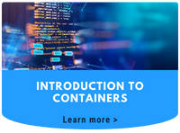

<head>
  <title>Guides | Civo Documentation</title>
</head>

## Overview

These guides help to navigate the Civo platform effectively, ensuring the ability to fully leverage the cloud services offered. These guides serve multiple purposes, catering to a diverse range of user needs, from beginners to advanced developers and IT professionals.

 &nbsp;&nbsp;  &nbsp;&nbsp;  &nbsp;&nbsp;  &nbsp;&nbsp;  &nbsp;&nbsp;  &nbsp;&nbsp;  &nbsp;&nbsp; 