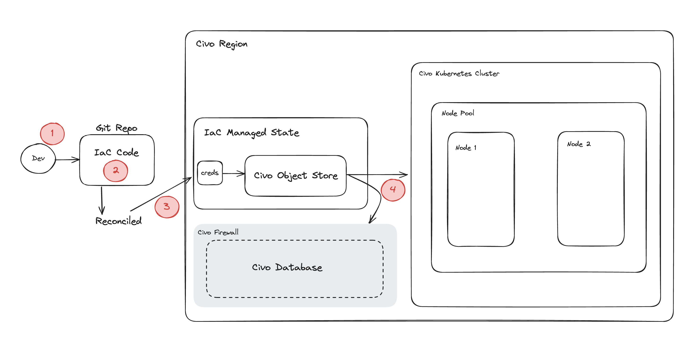

## Overview

This diagram showcases a common setup on Civo cloud, built using infrastructure as code tools.

1. A developer submits their code to a Git Repo
2. The IaC code is reconciled with the tool
3. The tool authenticates to the Civo cloud account
4. The cloud resources are created (e.g. K8s Cluster & Civo Database) 